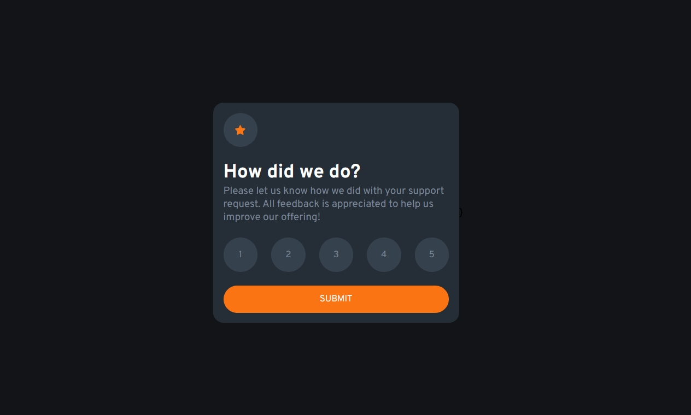

# Frontend Mentor - Interactive rating component solution

This is a solution to the [Interactive rating component challenge on Frontend Mentor](https://www.frontendmentor.io/challenges/interactive-rating-component-koxpeBUmI). If you're looking to enhance your coding skills and practice, I highly recommend Frontend Mentor. It's especially beneficial when you need to boost your creativity and improve your coding abilities through practical projects.

## Table of contents

- [Overview](#overview)
  - [The challenge](#the-challenge)
  - [Screenshot](#screenshot)
  - [Links](#links)
- [My process](#my-process)
  - [Built with](#built-with)
  - [What I learned](#what-i-learned)
  - [Continued development](#continued-development)
  - [Useful resources](#useful-resources)
- [Author](#author)
- [Acknowledgments](#acknowledgments)

## Overview

### The challenge

Users should be able to:

- View the optimal layout for the app depending on their device's screen size
- See hover states for all interactive elements on the page
- Select and submit a number rating
- See the "Thank you" card state after submitting a rating

### Screenshot

### Links

- Solution URL: [GitHub Repository](https://github.com/felix-toledo)
- Live Site URL: [GitHub Pages](https://felix-toledo.github.io/)

## My process

### Built with

- CSS custom properties
- CSS Flexbox
- React
- Vite

### What I learned

Through this project, I created my first React component. without external assistance. The most challenging aspect for me was managing component state transitions upon submitting the form.

### Continued development

In future projects, my goal is to further explore React and its various hooks. Additionally, I plan to start utilizing Tailwind CSS to streamline my styling workflow.

### Useful resources

- [ChatGPT](https://chat.openai.com) - I found ChatGPT to be a valuable resource for assistance and guidance during this project.
- [Frontend Mentor](https://www.frontendmentor.io) - I recommend Frontend Mentor for those looking to enhance their coding skills and practice by building realistic projects. It's particularly helpful when you're low on creativity and need a structured challenge.
- [React Documentation](https://react.dev/reference/react) - The new react documentation is one of the best documentations that I've read. 

## Author

- Website - [Felix Toledo](https://github.com/felix-toledo)
- Frontend Mentor - [@felix-toledo](https://www.frontendmentor.io/profile/felix-toledo)
- Twitter - [@_felixtoledo](https://www.twitter.com/_felixtoledo)

## Acknowledgments

I embarked on this challenge to improve my proficiency in React, especially in handling components and using the useState hook. The process involved developing the program logic and then focusing on the design aspect.